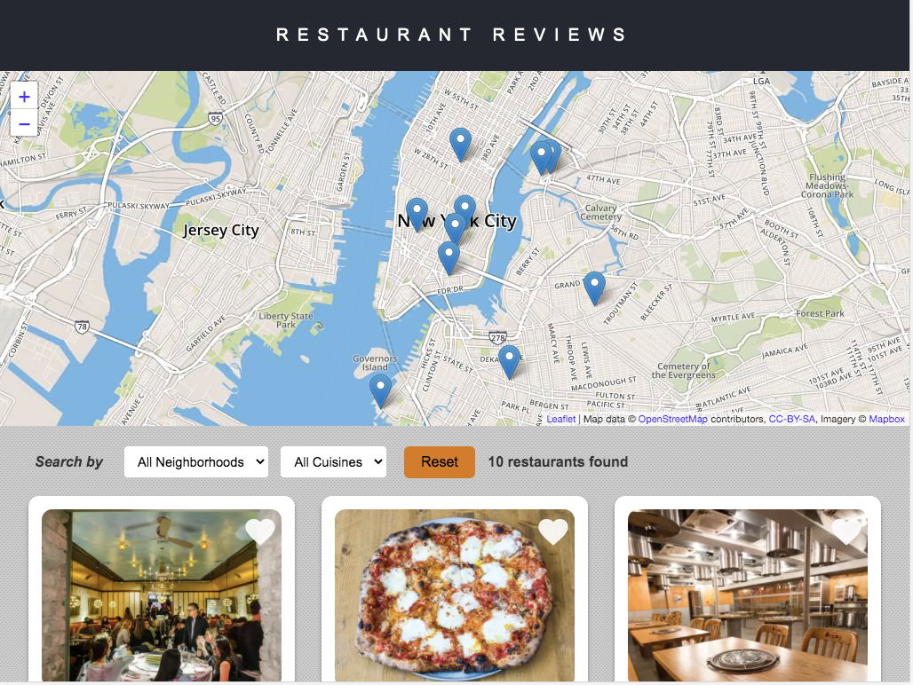

# Udacity Mobile Web Specialist Restaurant Review Project

This is a case study project as part of Udacity Mobile Web Specialist Nanodegree which consist of three stages. The given initial code is gradually revised to achieve accesibility standard, more responsive. Moreover, offline first approach as a key characteristic of modern Progressive Web Application is also applied.   

<div align="center">
        
</div>

<br>

## Getting Started

These instructions will get you a copy of the project up and running on your local machine for development and testing purposes. See deployment for notes on how to deploy the project on a live system.

### Prerequisites

1. Python as Server

2. ~~Google MAP API~~ Leaflet.js and MapBox

3. GraphicsMagick as Image Processing Tool

4. NPM Package

5. Hebrew

6. Gulp as Automated Task Script

7. SASS

### Installing

#### How to Install and Run Python Server

1. If Python is not installed, navigate to Python's [website](https://www.python.org/) to download and install the software.

2. In a terminal, check the version of Python you have: `python -V`. If you have Python 2.x, spin up the server with `python -m SimpleHTTPServer 8000` (or some other port, if port 8000 is already in use.) For Python 3.x, you can use `python3 -m http.server 8000`. 

3. With your server running, visit the site: `http://localhost:8000`

#### Leaflet.js and Mapbox:

This repository uses [leafletjs](https://leafletjs.com/) with [Mapbox](https://www.mapbox.com/). You need to replace `<your MAPBOX API KEY HERE>` with a token from [Mapbox](https://www.mapbox.com/). Mapbox is free to use, and does not require any payment information. 

#### Note about ES6

Most of the code in this project has been written to the ES6 JavaScript specification for compatibility with modern web browsers and future proofing JavaScript code. As much as possible, try to maintain use of ES6 in any additional JavaScript you write. 

#### How to Install SASS

```
$ sudo gem install sass
```

More information on: [How to install Sass on Mac](https://www.dyclassroom.com/howto-mac/how-to-install-sass-on-mac)

### Project Criteria

There are three aspect are considered based on [Udacity Rubric Specification](https://review.udacity.com/#!/rubrics/1090/view)

#### Responsive Design

##### Layout Design Pattern
I use CSS Grid to handle the whole presentation of front end layout. It is easier to use CSS Grid compared to CSS Flexbox, since it is able to configure main content much easier in 2 dimensional ways, row and column. In index.html, CSS Grid is applied to main content to create auto-sizing restaurant list in columns. As mentioned in [CSS Tricks](https://css-tricks.com/auto-sizing-columns-css-grid-auto-fill-vs-auto-fit/) "More specifically, our ability to specify how many columns we want in the grid and then letting the browser handle the responsiveness of those columns for us, showing fewer columns on smaller viewport sizes, and more columns as the screen estate allows for more, without needing to write a single media query to dictate this responsive behavior". In restaurant.html, CSS Grid is applied in main content to change 2 columns for wider viewport to 1 column for narrow viewport as well change the order display.

index.html

```
#restaurants-list {    
    display: grid;
    grid-template-columns: repeat(auto-fill, minmax(250px, 1fr));
    grid-gap: 30px;
    margin: 0 auto;
    max-width: 960px;
}
```

restaurant.html

```
.inside #maincontent {
  display: grid;
  grid-area: main-content;
  grid-template-columns: repeat(2, [col] 50%);
  grid-template-rows: repeat(4, [row] auto);
  grid-template-areas:     
    "restaurant-info restaurant-photo-container"
    "restaurant-hours-wrapper map-container"
    "reviews-container reviews-container";
  /* other styles code*/
}
```
Specify name for each area mentioned in *grid-template-areas*. For example:

```
#restaurant-info { 
    /* other styles code*/
    grid-area: restaurant-info;  
}

#restaurant-photo-container { 
    /* other styles code*/
    grid-area: restaurant-photo-container;  
}
```

##### Breakpoint
Only use 1 breakpoint, which is 768px as specified in media queries in responsive.css. Responsive.css is added mainly to cover responsive design style.

```
@media (max-width: 768px) {...}
```

##### Responsive Images
Using gulp automated tools to create script to resize images into 3 different size of images, which are: 375px, 480px and the original size 800px of width. The 3 different images size are choosen based on main content's max-width 960px setup. In index.html, images of restaurant list are display about more than a quarter of main content's width. Whereas in restaurant.html, restaurant's images are shown about half of main content's width. [This article](https://medium.com/hceverything/applying-srcset-choosing-the-right-sizes-for-responsive-images-at-different-breakpoints-a0433450a4a3) helps to guide choosing the sizes for responsive images. +

Picture elements with srcset are added using JavaScript to feed appropriate images based on the viewport width.


##### Font Icons
I use Font Awesome Icons to add map marker icon before the restaurant name in restaurant html. 

```
<link rel="stylesheet" href="https://cdnjs.cloudflare.com/ajax/libs/font-awesome/4.7.0/css/font-awesome.min.css">
```

```
<span class="fa fa-map-marker" aria-hidden></span> 
```


#### Accessibility
Here are some changes in code to make the site more accessible to people with disabilities.

_index.html_

* Create skip link to skip map navigation to access main content directly.

* Add `aria-label` for map and restaurant list element.

* Add `aria-labelledby` for combo box to describe the number of list item.

* ADd `aria-label` for View Details button.

NOTE: VoiceOver utility and ChromeVox Chrome extension give different description for the ARIA attributes. `CMD+F5` to turn on VoiceOver on OS X. `CTRL+Option+U` to open Web Rotor. Open Chrome Extension to turn on ChromeVox.

_restaurant.html_

* Add `aria-hidden` for decorative map marker icon located by the restaurant address.

* Add `aria-label` for breadcrumb and `aria-current` for the last item of breadcrumb to indiccate current page shown.

_For both of site pages_

* Add `role = navigation` for nav element in case the browser does not support ARIA.

* Add alt for all images.

Other than adding aria role, name and state, I change some non prominent color of some elements.

#### Offline Ability

Registered service worker and caching static files as well as images dynamically. Images will be caches based on the fetched url.

## Built With

* [CSS Grid](https://css-tricks.com/snippets/css/complete-guide-grid/) - The css layout system used
* [Gulp](https://gulpjs.com/)
* [GraphicsMagick](http://www.graphicsmagick.org/)

## Contributing

Please read [CONTRIBUTING.md]() for details on our code of conduct, and the process for submitting pull requests to us.


## Authors

* **Renata Santoso**
* **Udacity** - *skeleton* - [Udacity](https://github.com/udacity/mws-restaurant-stage-1)
 


## License

This project is licensed under the MIT License - see the [LICENSE.md]() file for details

## Acknowledgments

* My mentor: chemseddine
